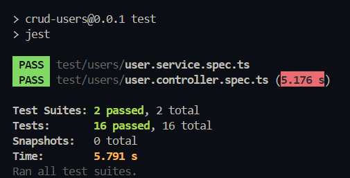

# Gestión de Usuarios - API RESTful con NestJS

## Descripción del Proyecto

Este proyecto es una API RESTful construida con el marco NestJS, diseñada para gestionar usuarios. Proporciona funcionalidades para crear, leer, actualizar y eliminar usuarios, así como para manejar permisos y roles. La API está diseñada para ser escalable y fácil de mantener, siguiendo las mejores prácticas de desarrollo de software.

## Funcionalidades

- **Crear un nuevo usuario**: Permite la creación de un usuario proporcionando los datos necesarios.
- **Obtener lista de usuarios**: Permite obtener una lista de todos los usuarios activos, con la opción de filtrar por nombre o correo electrónico.
- **Obtener un usuario por ID**: Permite recuperar la información de un usuario específico utilizando su ID.
- **Actualizar un usuario**: Permite actualizar la información de un usuario existente.
- **Eliminar un usuario**: Permite eliminar un usuario de forma lógica, marcándolo como inactivo.

## Requisitos Previos

Antes de comenzar, asegúrate de tener instalado lo siguiente en tu máquina:

- [Node.js](https://nodejs.org/) (v16 o superior)
- [NPM](https://www.npmjs.com/) (v8 o superior)
- [NestJS CLI](https://docs.nestjs.com/cli/overview) (opcional, pero recomendado)

## Configuración del Proyecto

1. Clona el repositorio:

```bash
git clone https://github.com/TomyTiseira/Crud-Users-Nestjs.git
cd Crud-Users-Nestjs
```

2. Instalar dependencias:

```bash
npm install
```

3. Configura las variables de entorno

Crea un archivo `.env` en la raíz del proyecto con la siguiente estructura:

```bash
PORT=3000
```

## Compilar y Ejecutar el Proyecto

### Modo de desarrollo:

```bash
npm run start:dev
```

### Modo de producción:

```bash
npm run build
npm run start:prod
```

## Ejecutar con Docker

### Construir y ejecutar la aplicación

Construir la imagen de Docker:

```bash
docker build -t nestjs-app .
```

Ejecutar el contenedor:

```bash
docker run -p 3000:3000 nestjs-app
```

## Ejecutar Pruebas

### Pruebas unitarias:

```bash
npm run test
```

## Documentación de la API

La documentación de la API está generada con Swagger y puede ser accedida en:

```bash
http://localhost:3000/api
```

## Resultados de las Pruebas

Aquí se muestran los resultados de la ejecución de las pruebas:


